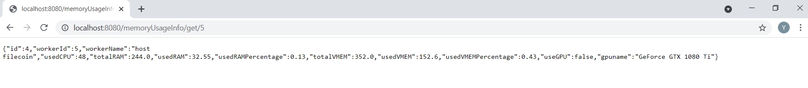

# RESTful API

<ul>
<li>The RESTful APIs are written in Java Spring Boot framework, using Model–view–controller (MVC) design pattern and Dependency Injection</li>
<li>The APIs use layered architecture to handle HTTP requests. <strong>repository</strong> layer contains data access functionality, <strong>service</strong> layer deals with application logic and <strong>controller</strong> layer processes RESTful API requests and controls data flow into model object</li>
<li>Data is stored in MySQL (database configuration can be found at src/main/resources/application.properties) and accessed through Spring Data JPA</li>
</ul>

<h3>Step 1: Write RESTful APIs</h3>
<h4>Worker data is hard-coded into the "memory_info" table in MySQL "restfulAPI" database (see MySQL folder)</h4>

<h4>HTTP Get request for all worker data results in the following result</h4>

<h4>HTTP Get request for specific worker data results in the following result</h4>

<h4>Error messages will show up if calling the wrong url or calling a non-existent worker</h4>

<h3>Step 2: Write unit tests for above API calls using JUnit testing framework. The codes can be found at src/test/java/com/demo/restfulAPI/HttpRequestTest.java</h3>

<h4>Folder UnitTest contains a test report in xml format</h4>

<h3>Step 3: The SAVE2CSV function is in src/main/java/com/demo/restfulAPI/service/MemoryService.java and called by src/main/java/com/demo/restfulAPI/controller/MemoryController.java</h3>

<h3>Step 4: Record actions and result to the "call_info" table in MySQL "restfulAPI" database</h3>
<h4> MySQL folder contains schema for the "call_info" table</h4>

<h4>I also created a CallController for handling this HTTP Post request, which is executed every time an API is called. We can also call this endpoint directly from Postman as shown by following example</h4>

